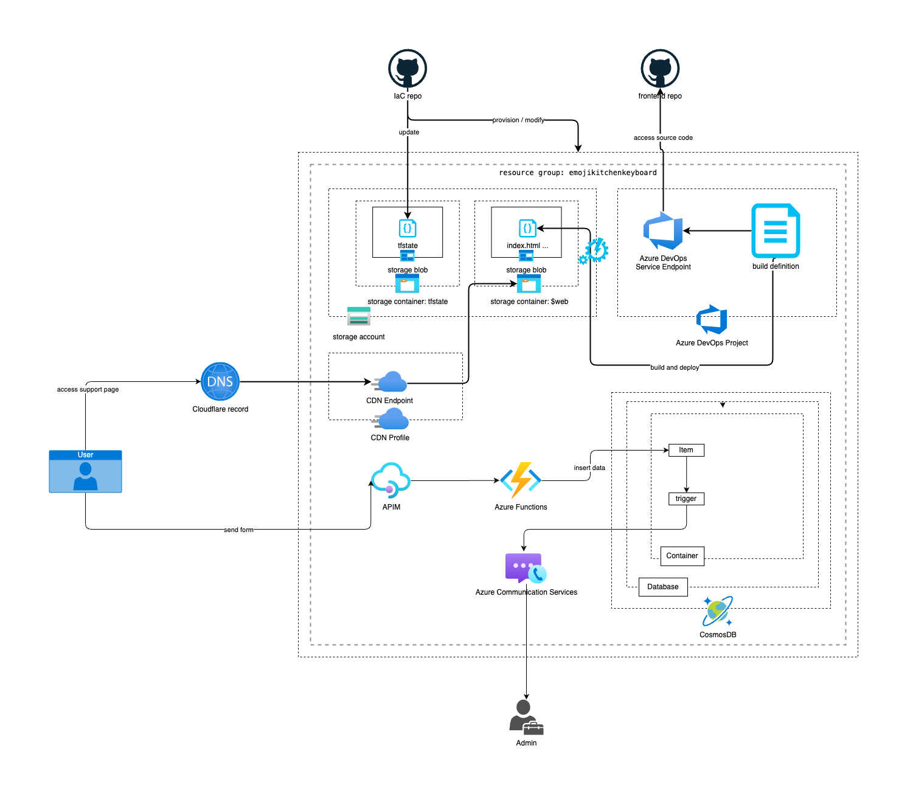

[](https://github.com/VardyNg/emoji-kitchen-keyboard-support-web/actions/workflows/deploy.yaml)
# Emoji Kitchen Keyboard Support Web Infrastructure-as-Code (IaC) repo
This repo contains the infrastructure for the web component of the [Emoji Kitchen keyboard support page](https://emojikitchenkeyboard.vardyng.com).


For the source code of the support page, please refer to [this repo](https://github.com/VardyNg/emoji-kitchen-keyboard-support-web)
## Setup permission / credentials
- for hashicorp/azurerm
  ```sh
  az login
  ```
- for microsoft/azuredevops  
  [Guide](https://registry.terraform.io/providers/microsoft/azuredevops/latest/docs/guides/authenticating_using_the_personal_access_token)
  ```sh
  export AZDO_PERSONAL_ACCESS_TOKEN=<Personal Access Token>
  export AZDO_ORG_SERVICE_URL=https://dev.azure.com/<Your Org Name>
  ```
- for cloudflare/cloudflare
  ```sh
  export TF_VAR_cloudflare_zone_id=<Cloudflare Zone ID>
  export CLOUDFLARE_API_TOKEN=<Cloudflare API Token>
  ```
- for Azure Pipeline to access GitHub repo
  ```sh
  export TF_VAR_web_github_pat=<GitHub Personal Access Token>
  ```
## Initialize project
```sh 
terraform init
```

## Plan and apply
```sh
terraform plan
```

```sh
terraform apply
```
